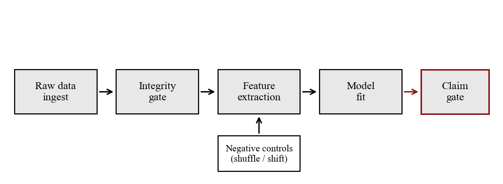
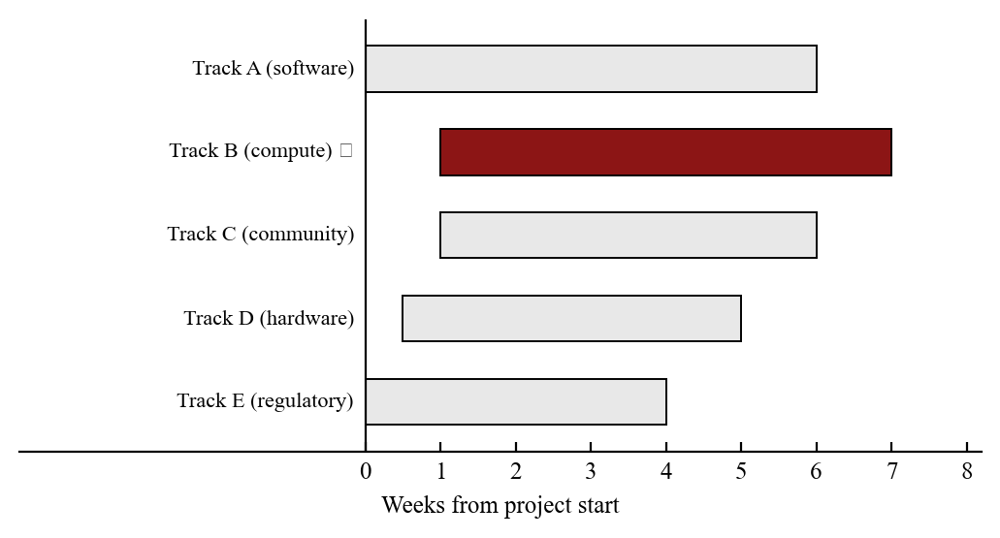
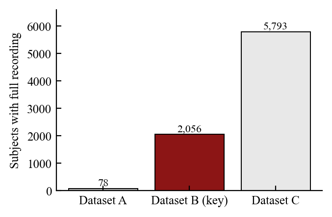
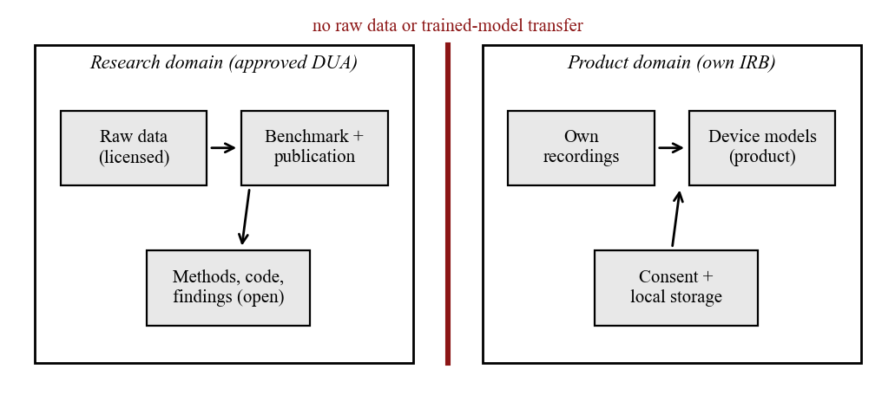
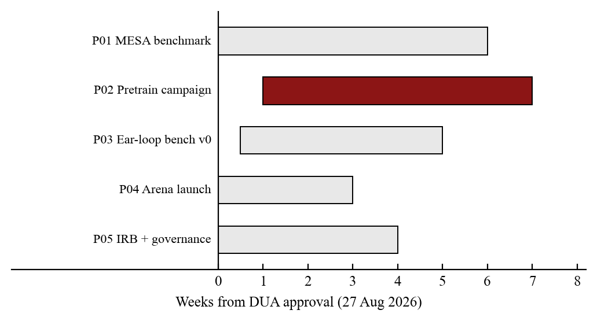
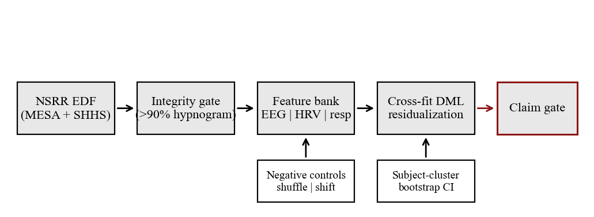
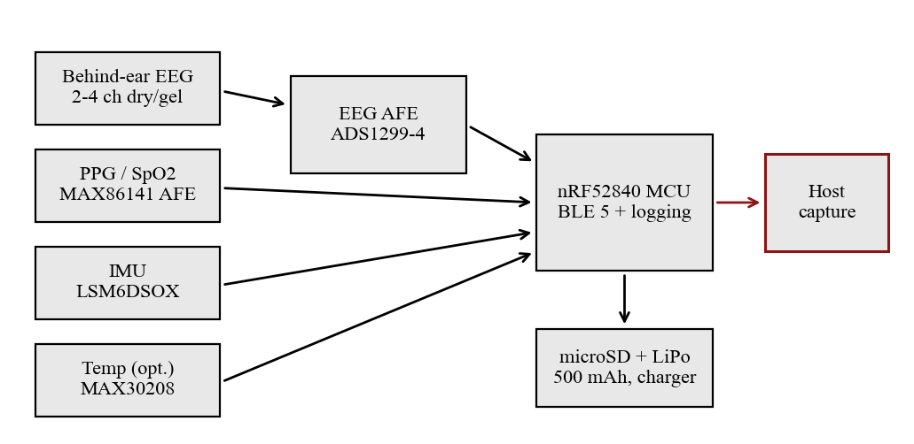
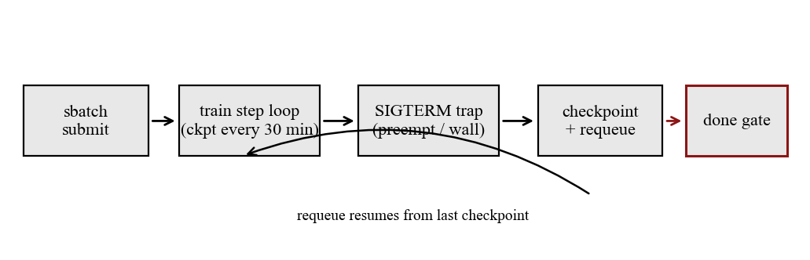

# kahlus-science-kit

Reusable scripts, templates, and workflows for building publication-quality scientific
documents — the exact stack we use for the Kahlus research program.

## What's in here

| Path | What it does |
|---|---|
| `figures/make_figures.py` | Matplotlib house-style figure generator |
| `figures/style.py` | Shared rcParams, colors, helper functions |
| `latex/preamble.tex` | LaTeX preamble (Times, booktabs, fancyhdr, siunitx) |
| `latex/template.tex` | Minimal document shell using the preamble |
| `docx/make_docs.py` | python-docx DOCX builder (same ME-report house style) |
| `docx/helpers.py` | Reusable DOCX helpers (title block, hrule, table, figure, etc.) |
| `examples/` | Runnable end-to-end demos |
| `docs/workflow.md` | How everything fits together |
| `research/storm_bridge.py` | **Stanford STORM → this pipeline.** Parses a STORM run, audits the evidence base, emits LaTeX/Markdown |
| `research/test_storm_bridge.py` | 16 assert-based checks, no framework, no network |
| `skills/humanize.md` | Strips the statistical fingerprint of machine-written prose |
| `skills/ai-check.md` | Scores text A–I on the signals detectors actually measure |
| `skills/scientific-figures.md` | Figure genre selection and layout rules |

---

## Research → document: the STORM bridge

Stanford's [STORM](https://github.com/stanford-oval/storm) (MIT licensed) does retrieval and
multi-perspective outlining. It writes a cited article and stops there — the package contains
**zero** matplotlib imports and no typesetting.

This kit is the opposite shape: house figure style, LaTeX preamble, DOCX builder, prose-quality
skills, and no research stage. So they compose:

```
STORM                    storm_bridge.py              this kit
retrieval + outline  ->  parse, audit, emit       ->  figures / LaTeX / DOCX
```

```bash
pip install knowledge-storm            # STORM is a dependency, not vendored
python research/storm_bridge.py --storm-output ./results/my_topic --figures
```

Output:

```
  topic      cold plasma wound therapy
  sections   3
  words      84
  sources    6 (4 peer-reviewed, 67%)
  domains    3
  ⚠ 2 retrieved sources are never cited in the text
```

### The source audit is the point

STORM retrieves from the open web, so a run mixes journal articles with blog posts. The bridge
makes that ratio explicit before you build a document on top of it:

- **peer-reviewed fraction** — classified by domain (doi.org, arXiv, PubMed, IEEE, AIAA, ASME, …)
- **orphan sources** — retrieved but never cited in the body, a sign the draft is thinner than its
  reference list implies
- **domain concentration** — rendered as a house-style figure, cardinal for peer-reviewed, gray for
  everything else

`[n]` markers become `\cite{srcN}` against a generated `thebibliography`, and the emitted `.tex`
compiles against `latex/preamble.tex` unmodified.

### The prose is machine-written and the tooling says so

The bridge writes that warning into the header of every file it emits. Run `skills/humanize.md`
over the draft, then `skills/ai-check.md` to score what survived. Neither is a laundering step:
**a citation still has to support the sentence it's attached to, and only a human can check that.**

```bash
python research/test_storm_bridge.py     # 16 checks, offline
```

---

## The house style

Every figure and document follows one rule set derived from old-school ME department reports
and reputable neuroscience/ML venues:

- **Font:** Times New Roman (serif) throughout, 9 pt figures, 11 pt body
- **Color:** monochrome + one accent `#8c1515` (Stanford cardinal) — no rainbow gradients
- **Ticks:** inward, axes linewidth 0.8
- **No text over data**, no 3-D bars, no pie charts
- **Figures from real data or real geometry only** — no invented curves, no AI-generated art
- **captions are bold-label + sentence** e.g. `Figure 1.  Pipeline overview.`
- **Page footer:** `Page X of Y` (both DOCX field codes and LaTeX `\pageref{LastPage}`)

---

## Example figures

<table>
<tr>
<td><br/><sub>Pipeline with claim gate</sub></td>
<td><br/><sub>Gantt timeline</sub></td>
</tr>
<tr>
<td><br/><sub>Cohort sizes</sub></td>
<td><br/><sub>Data governance wall</sub></td>
</tr>
<tr>
<td><br/><sub>Program critical path (real project)</sub></td>
<td><br/><sub>Benchmark pipeline (real project)</sub></td>
</tr>
<tr>
<td><br/><sub>Wearable signal chain</sub></td>
<td><br/><sub>Checkpoint state machine</sub></td>
</tr>
</table>

See [`examples/figures/`](examples/figures/) for all 22 figures.

---

## Quick start

```bash
pip install matplotlib python-docx
```

### Generate figures

```bash
cd figures
python make_figures.py          # writes PNGs to output/
```

### Build a DOCX

```bash
cd docx
python make_docs.py             # writes example.docx
```

### Build a LaTeX PDF

```bash
cd latex
pdflatex template.tex
pdflatex template.tex           # twice for references/pagecount
```

---

## How we created the Kahlus docs

### Step 1 — figures first

`figures/make_figures.py` generates all PNGs from pure Python + matplotlib.
No Illustrator, no AI image tools. Each function is one self-contained figure:

```python
def p01_pipeline():
    fig, ax = plt.subplots(figsize=(6.4, 2.2))
    # ... draw boxes, arrows, labels with real data ...
    savefig(fig, "output", "fig_pipeline.png")
```

Run once → all figures written to `output/`. They are committed to git so the
document build is reproducible without re-running the science.

### Step 2 — document body (two paths)

**Path A: DOCX** (for professor submissions, fast iteration)

`docx/make_docs.py` builds Word documents programmatically with python-docx.
Every document uses the same `title_block()`, `abstract()`, `section()`,
`figure()`, `table()`, `references()` helpers so they look identical.

```python
doc = new_doc()
title_block(doc, series="P01", title="...", subtitle="...", doc_type="Technical Plan")
abstract(doc, "...")
section(doc, "Pipeline")
figure(doc, "output/fig_pipeline.png", width=6.0, label="Figure 1.", cap="...")
table(doc, "Table 1.", "...", header=[...], rows=[...])
references(doc, ["...", "..."])
doc.save("P01.docx")
```

**Path B: LaTeX** (for preprints, PDFs to send externally)

`latex/preamble.tex` sets up the full ME-report style. Documents just `\input{preamble}`
and call `\kahlustitle{...}` then write normal LaTeX. Compile with `pdflatex` twice.

### Step 3 — LaTeX master packet (multi-project)

For the program packet we build one PDF per project (`p01.tex`, `p02.tex`, …) then
assemble them into a master with `\includepdf` (pdfpages). The build script
`_build/make_docs.py` orchestrates both figure generation and doc generation in one call.

### Step 4 — visual standards check

Before committing any figure, check it against `docs/visual-standards.md`:
- Does every axis have a label?
- Is there a scale bar or unit in the caption?
- Does the accent color appear ≤ 2× per figure?
- Would it survive black-and-white printing?

---

## File layout of a finished project folder

```
ProjectName/
  figures/
    fig_pipeline.png        ← generated by make_figures.py
    fig_cohorts.png
    img_reference.jpg       ← external CC image, captioned with source
  ProjectName.pdf           ← compiled LaTeX or exported DOCX
  ProjectName.docx          ← python-docx output (optional)
```

---

## Skills and AI agent instructions

When asking an AI agent to build a document in this style, paste the relevant
section of `docs/workflow.md` as context, or just point at this repo.

The agent prompt we used:

> "Build a Kahlus-style document. Read kahlus_preamble.tex and make_docs.py for the
> house format. Generate figures from real data with make_figures.py style.
> No invented numbers, no AI-generated art. One accent color #8c1515. Times New Roman.
> Page X of Y footer. Bold-label captions."

---

## Requirements

```
matplotlib >= 3.7
python-docx >= 1.1
pdflatex (TeX Live or MacTeX)
```
